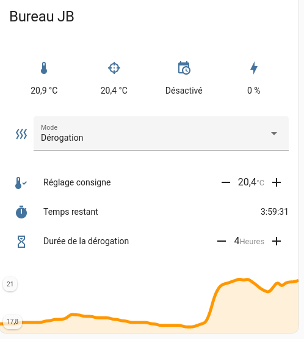

## Home Assistant - Gestion de bout en bout du chauffage

This repository contains the files of a post in HACF french forum, adapted to fit my personal setup.

It is the complete implementation of a heating management system for home assistant: 
- Proportional thermostat
- Heating modes
- Time schedule
- Override mode 

Please see https://forum.hacf.fr/t/gestion-de-bout-en-bout-du-chauffage/4897 for the original resources

## Setup

### Helpers

A few helpers are needed : 

- Input numbers:
  - room target temperature
  - Override duration
  - power target for the heater (computed by the proportional thermostat)
- Input select for selecting the heating mode 
- Timer for the override duration 

```yaml
input_number:
  target:  # The target temperature of the room
    name: Target temperature
    min: 0
    max: 30
    step: 0.2
    mode: slider 
    unit_of_measurement: °C
    icon: mdi:thermometer-check
  power:  # The power value for the heater
    name: heater power
    min: 0
    max: 100
    step: 1
    mode: box
    unit_of_measurement: %
    icon: mdi:lightning-bolt-circle
  override:  # The override duration
    name: Override duration
    min: 0
    max: 12
    step: 1
    mode: slider
    unit_of_measurement: Hours
    icon: mdi:timer-sand
input_select:
  heater_mode:
    name: heater mode
    options:
      - Auto       # Will use the temperature set by the scheduler
      - Dérogation # Override
      - Hors-gel   # Avoid freezing 
      - Stop       # for the Summer 
      - Absent     # Out of the house
    icon: mdi:heat-wave
timer:
  heater_derog:
    name: Heater override duration
    icon: mdi:timer
```

### Schedule 

In this setup I use the scheduler and scheduler card from HACS to setup the times and schedules. 
See here: https://github.com/nielsfaber/scheduler-component

### Blueprints

Once you have created the helpers and the scheduler you can create the automations using the blueprints. 
Create the "Thermostat TPI" first, then the "Pilotage chauffage"

### Lovelace Card



```yaml
type: custom:vertical-stack-in-card
title: Salon
style: |
  ha-card {
  overflow: visible !important;
  }
cards:
  - type: custom:hui-element
    card_type: glance
    show_name: false
    entities:
      - entity: sensor.salon_temperature_sonoff_temperature
      - entity: input_number.salon_chauffage_consigne
        icon: mdi:target
      - entity: switch.schedule_salon_week_end
      - entity: sensor.salon_radiateur_conso
        icon: mdi:lightning-bolt
  - type: entities
    entities:
      - entity: input_select.salon_chauffage_mode
        name: Mode
  - type: conditional
    conditions:
      - entity: input_select.salon_chauffage_mode
        state: Dérogation
    card:
      type: entities
      entities:
        - entity: input_number.salon_chauffage_consigne
          type: custom:numberbox-card
          name: Réglage consigne
        - entity: timer.salon_chauffage_derogation
          name: Temps restant
        - entity: input_number.salon_chauffage_duree_derog
          type: custom:numberbox-card
          name: Durée de la dérogation
  - type: custom:mini-graph-card
    entities:
      - sensor.salon_temperature_sonoff_temperature
    points_per_hour: 3
    align_state: right
    font_size: 75
    height: 100
    show:
      name: false
      legend: true
      icon: false
      labels: true
      state: false
```

There is an issue due to
https://github.com/ofekashery/vertical-stack-in-card/issues/120